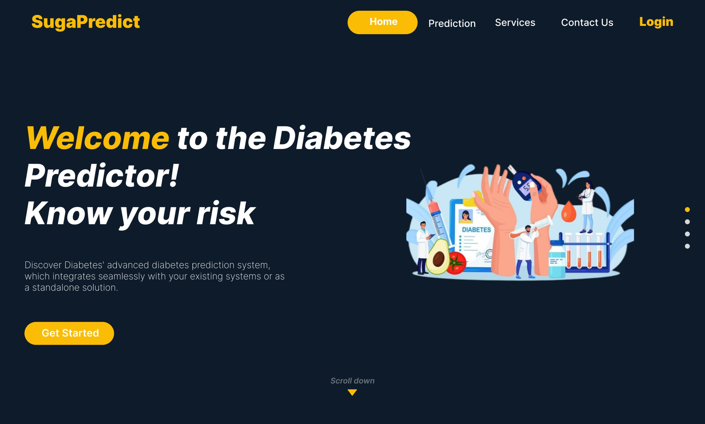
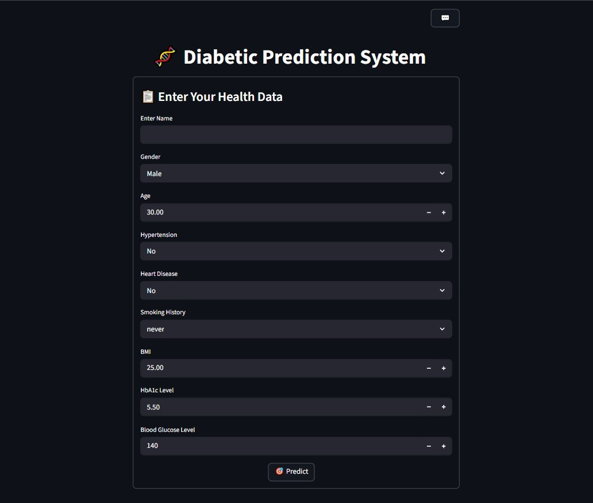

# Diabetes Prediction & AI Healthcare Assistant

An intelligent healthcare web application that combines **Machine Learning** and **Large Language Models (LLMs)** to help users predict diabetes risk, receive personalized medical advice, and interact with an AI-powered diabetes assistant.

The system is designed to provide an interactive and user-friendly experience for diabetes awareness and self-management support.

---

# Features

## 1. Diabetes Prediction
Predict whether a patient is likely to have diabetes using a trained Machine Learning model based on medical attributes such as:

- Gender
- Age
- Hypertension
- Heart Disease
- Smoking History
- BMI
- HbA1c Level
- Blood Glucose Level

---

## 2. AI-Generated Follow-up Questions
The application dynamically generates intelligent follow-up questions using an LLM to better understand the patient’s condition and lifestyle.

---

## 3. Personalized Medical Advice
Generate customized diabetes management advice based on:
- Patient medical information
- Previous question-answer interactions
- Lifestyle and health indicators

---

## 4. AI Chatbot Assistant
An interactive chatbot that provides:
- General diabetes guidance
- Healthy lifestyle recommendations
- Quick answers related to diabetes care

---

# Technologies Used

## Backend
- Python
- Flask

## Machine Learning
- Scikit-learn
- NumPy
- Pandas
- Joblib

## AI / LLM
- OpenRouter API
- Mistral 7B Instruct

## Visualization
- Matplotlib
- Seaborn

---

# Project Structure

```bash
Diabetes-Prediction-System/
│
├── backend/
│   └── server.py
│
├── Frontend/
│   |── src
│   |── public
│   |── Services
│   └── index.html
|
├── model/
│   └── Diabetes_Prediction_Model.pkl
│
├── data/
│   |── diabetes_prediction_dataset.csv
│   └── preprocessed_diabetes_data.csv
|
├── GUI/
|   └── streamlit.py
|
├── screenshots/
|   └── Diabetic-Prediction-System.jpg
|
├── requirements.txt
│
└── README.md

````

---

# Installation

## 1. Clone the Repository

```bash
git clone https://github.com/ahmed-morad15/Diabetes-Prediction-System.git
cd diabetes-app
```

---

## 2. Create Virtual Environment

### Windows

```bash
python -m venv venv
```

Activate the environment:

```bash
venv\Scripts\activate
```

---

## 3. Install Requirements

```bash
pip install -r requirements.txt
```

---

# Run the Application

```bash
python backend/server.py
```

The server will run on:

```bash
http://127.0.0.1:5000
```

---

# API Endpoints

| Endpoint           | Method | Description                          |
| ------------------ | ------ | ------------------------------------ |
| `/predict`         | POST   | Predict diabetes                     |
| `/next-question`   | POST   | Generate dynamic follow-up question  |
| `/generate-advice` | POST   | Generate personalized medical advice |
| `/chat`            | POST   | Chatbot interaction                  |

---

# Example Prediction Request

```json
{
  "gender": 1,
  "age": 45,
  "hypertension": 0,
  "heart_disease": 0,
  "smoking_history": 1,
  "bmi": 28.5,
  "HbA1c_level": 6.2,
  "blood_glucose_level": 145
}
```

---

# GUI Screenshots

## Main Interface


---

## Prediction Result


---

# Future Improvements

* User authentication system
* Doctor-patient communication module
* Deployment on cloud platforms
* Medical report upload and analysis
* Real-time monitoring dashboard

---